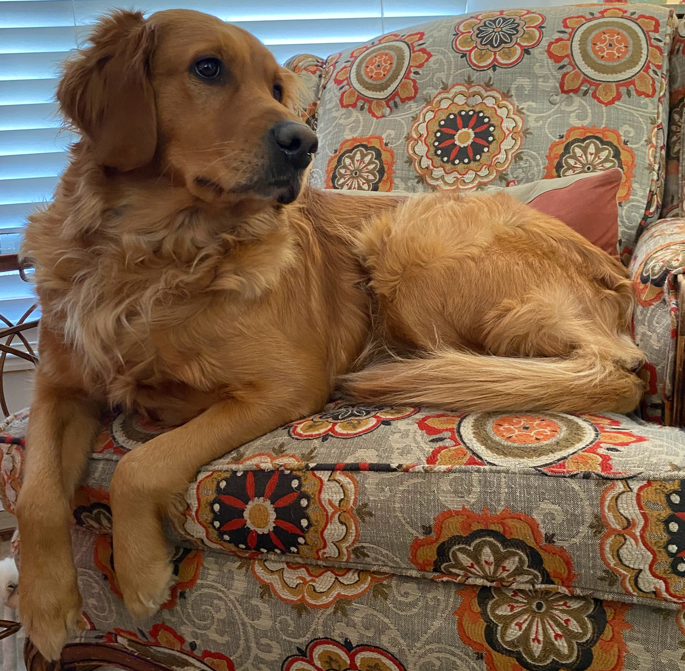

# Colorado Golden Retrievers

## About Us
We have been raising and training golden retrievers for almost 20 years. 

## Gretel
Gretel is a dark red golden from a line of distinguished field dogs. She is an absolute sweetheart---she is wonderful with children, cats, other animals and, above-all, with people! Her intelligence, focus, and drive have made her easy to train. She earned her first scent work titles at just 8 months old, her Tracking Dog (TD) title at 14 months, and her Tracking Dog Excellent (TDX) title a year later.

### Health
Gretel has completed all health screenings to recieve the Canine Health Information Center certification (CHIC# 176357).

##### Hips: Good (OFA GR-138260G31F-P-VPI)
##### Elbows: Normal (OFA GR-EL57875F31-P-VPI)
##### Eyes: Normal (OFA GR-EYE29027/33F-VPI)
##### Heart: Normal (OFA GR-BCA5898/34F/C-VPI)

In addition, we have had genetic testing performed and Gretel has been cleared of the following genetic diseases:

### Titles

### Pedigree
